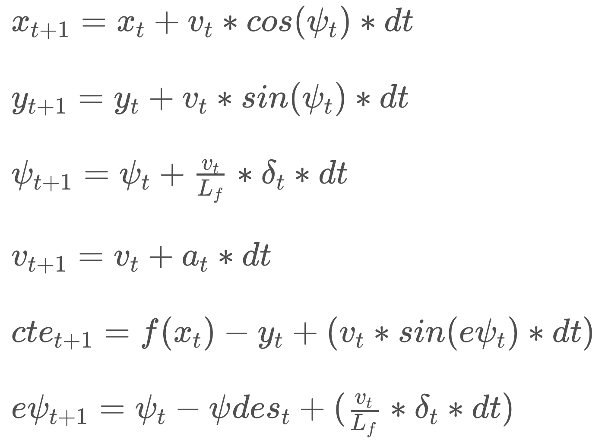

# Rubric Questions

## The Model
> Student describes their model in detail. This includes the state, actuators and update equations.

The model used for this project is based on the kinematic model learned during the lessons. Its state contains the following variables:

`x`, `y` position 
`psi` heading 
`v` velocity 
`cte` cross-track error 
`epsi` heading error

The available actuators are:

`delta` steering angle 
`a` acceleration

The model takes the values of its current state and previous actuations to calculate the state and actuations for the next time step via the following equations:

## Timestep Length and Elapsed Duration (N & dt)
> Student discusses the reasoning behind the chosen N (timestep length) and dt (elapsed duration between timesteps) values. Additionally the student details the previous values tried.

After trying a couple of values for `N` and `dt` I sticked to `N=10` and `dt=0.1`.

I also tried higher resolutions by setting `dt=0.05` and longer prediction-ranges by setting `N=30`. The higher resolution did not improve the results significantly. Furthermore, increasing `N` was rather detrimental, because errors in the distant had to be considered, which impaired the performance of the optimization, i.e. the result was worse.

## Polynomial Fitting and MPC Preprocessing
> A polynomial is fitted to waypoints.
> If the student preprocesses waypoints, the vehicle state, and/or actuators prior to the MPC procedure it is described.

The waypoints were transformed to vehicle coordinate system and the fit to a 3rd order polynomial.

## Model Predictive Control with Latency
> The student implements Model Predictive Control that handles a 100 millisecond latency. Student provides details on how they deal with latency.

I incorporated the latency by computing the predicted state for the next time step (`dt=0.1` i.e. 100ms later) and passing the predicted state to the optimizer.

